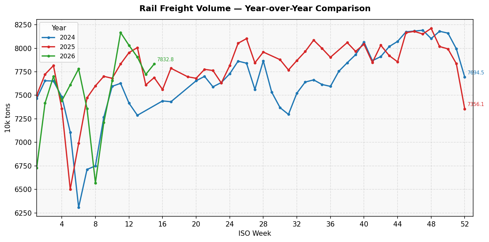
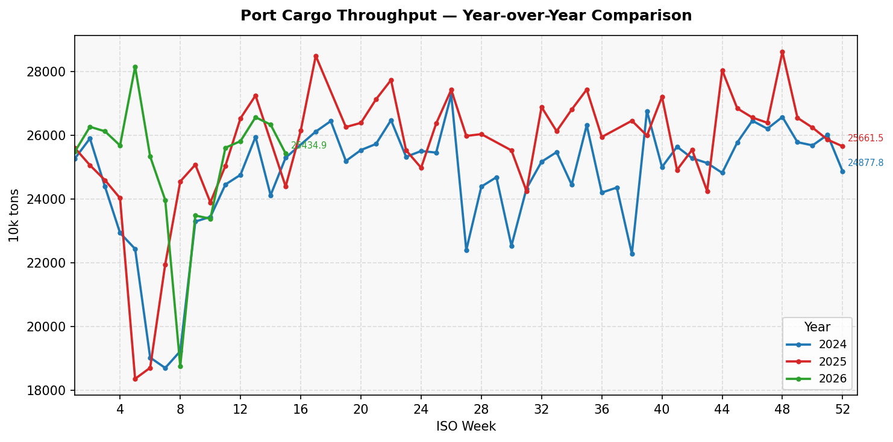
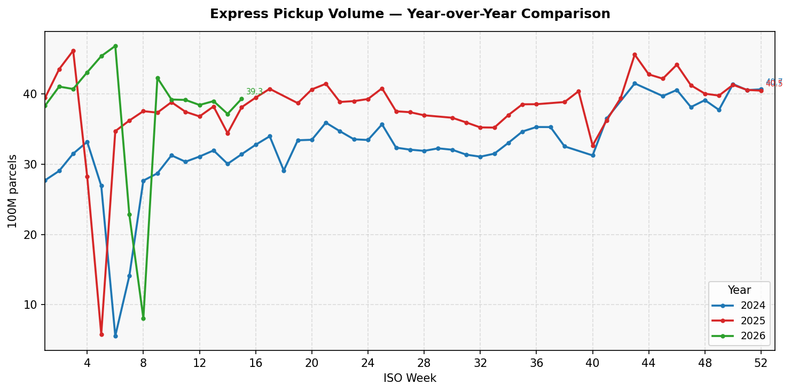
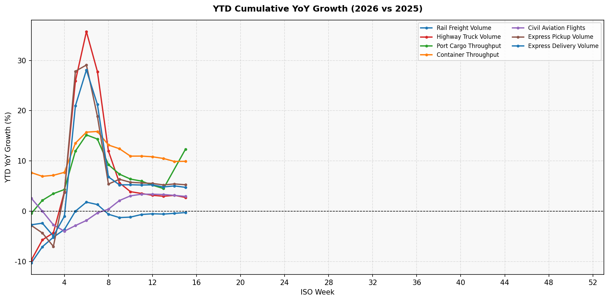

# China Logistics Pulse 中国物流脉搏

[](https://github.com)
[](https://www.mot.gov.cn/zhuanti/wuliubtbc/qingkuangtongbao_wuliu/)

追踪中国物流运行的周度高频数据，数据来源：**交通运输部"物流保通保畅"专题**。

## 数据说明

| 指标 | 单位 | 说明 |
|------|------|------|
| 国家铁路货运量 | 万吨/周 | 国家铁路全周运输货物总量 |
| 高速公路货车通行量 | 万辆/周 | 全国高速公路货车通行总量 |
| 港口货物吞吐量 | 万吨/周 | 监测港口完成货物吞吐量 |
| 集装箱吞吐量 | 万TEU/周 | 监测港口完成集装箱吞吐量 |
| 民航航班数 | 万班/周 | 民航保障航班总数（含货运） |
| 快递揽收量 | 亿件/周 | 邮政快递揽收量 |
| 快递投递量 | 亿件/周 | 邮政快递投递量 |

## 使用方法

```bash
# 安装依赖
pip install -r requirements.txt

# 首次运行（回填所有历史数据）
python scripts/01_init_db.py
python scripts/04_backfill.py --sleep 1

# 增量更新
python scripts/update.py

# 只重新生成图表
python scripts/update.py --charts-only
```

## 项目结构

```
china-logistics-pulse/
├── scripts/           # 数据抓取、解析、可视化脚本
├── data/              # SQLite 数据库
│   ├── logistics.db   # 结构化指标数据
│   └── links.db       # 链接管理数据库
├── charts/            # 生成的图表 PNG
└── examples/          # 参考 HTML 范例
```

## License

MIT

---

<!-- DYNAMIC_START -->

**最后更新：2026-04-15 04:44**


### 最近一期数据（2026-04-06 ~ 2026-04-12，ISO 2026-W15）

| 指标 | 本周值 |
|------|--------|
| 铁路货运量 | 7832.80 万吨 |
| 高速公路货车通行量 | 5294.10 万辆 |
| 港口货物吞吐量 | 25434.90 万吨 |
| 集装箱吞吐量 | 655.60 万TEU |
| 民航航班数 | 11.90 万班 |
| 快递揽收量 | 39.33 亿件 |
| 快递投递量 | 37.75 亿件 |

> 数据来源：[交通运输部通报](https://www.mot.gov.cn/zhuanti/wuliubtbc/qingkuangtongbao_wuliu/202604/t20260413_4203540.html)

### 核心图表

**铁路货运量**


**港口货物吞吐量**


**快递量**


**YTD 累计同比增速**



### 数据覆盖范围

从 **2022-W01** 到 **2026-W52**，共 **203** 周

<!-- DYNAMIC_END -->
